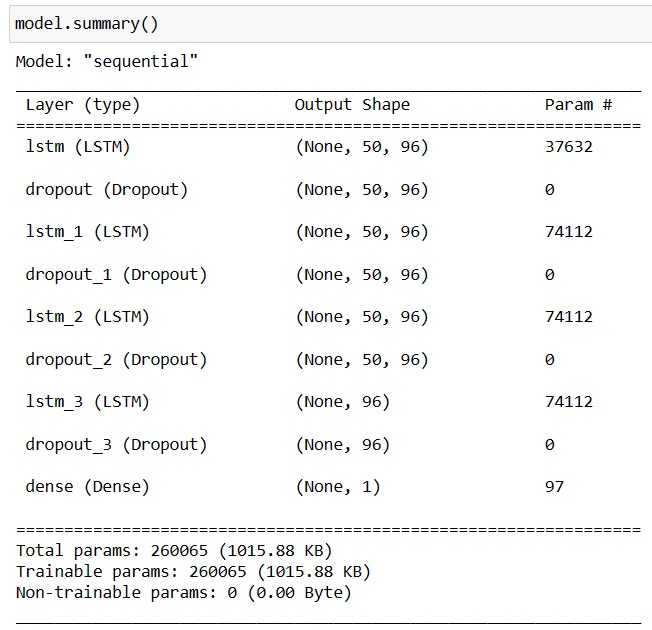
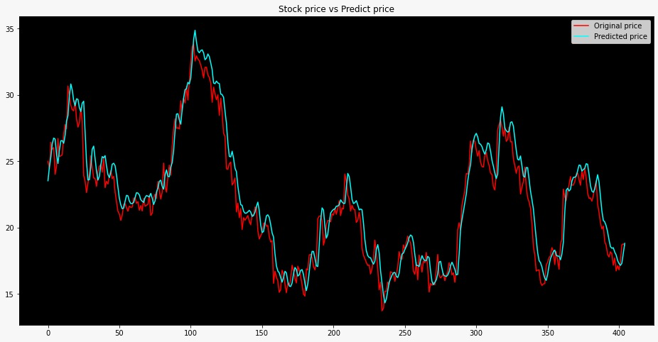
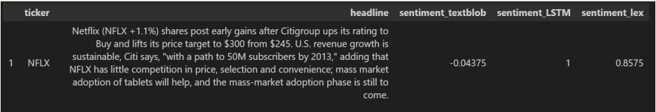
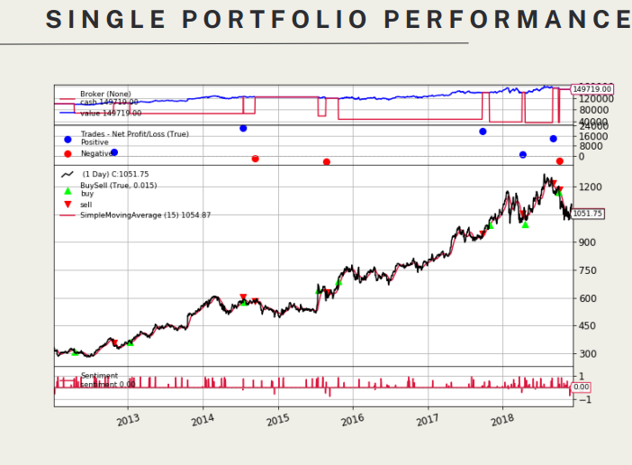

# Calculating trends in green stocks and using sentimental analysis on News RSS feed  

## Overview
LSTM Model is created to predict the closing prices of companies that are `environmental friendly`.

Sentiment Analysis is done on `News RSS feed`

## Dataset
Historical data of companies Stock is taken from `Yahoo Finance`. 

`Data/Raw Headline Data.zip` is used for Sentiment Analysis.

## LSTM Model
<p align="left">
 &ensp;&ensp;&ensp;&ensp;&ensp;&ensp;&ensp;&ensp;&ensp;
</p>

## Prerequisites
* Python 3 
* an IDE (preferably jupyter Notebook)
* Pandas 
* Numpy 
* Matplotlib 
* Sklearn
* Keras
* Tensorflow
* NLTK
* TextBlob
* Random forest regression
* Lexicon
  


All the external dependencies can be installed by using ```pip install -r requirements.txt```

## Results

### Stock Prediction

<p align="left">
 &ensp;&ensp;&ensp;&ensp;&ensp;&ensp;&ensp;&ensp;&ensp;
</p>

### Sentiment Analysis

<p align="left">
 &ensp;&ensp;&ensp;&ensp;&ensp;&ensp;&ensp;&ensp;&ensp;
</p>
All the sentiments have positive relationship with the return which is intuitive
and expected.
Used sentimental polarity for the trading alpha for Individual stocks and multiple
stocks.
<p align="left">
 &ensp;&ensp;&ensp;&ensp;&ensp;&ensp;&ensp;&ensp;&ensp;
</p>

* The results indicate an overall profit of
$49,719. The chart has three panels:
Top Panel: Displays the cash and total
portfolio value, starting at $100,000
and ending at $149,719.

* Second Panel (Trade Observer):
Shows the Profit and Loss at the end
of each trade. Five out of eight
buy/sell actions are profitable.

* Third Panel (Buy Sell Observer):
Indicates buy/sell operations on stock
prices, revealing a strategy of buying
during price increases and selling
during declines.


* Bottom Panel: Represents the
sentiment score over time.


## Author
* Tammireddy Sri Vallabh
* Adapa Jashkayth

